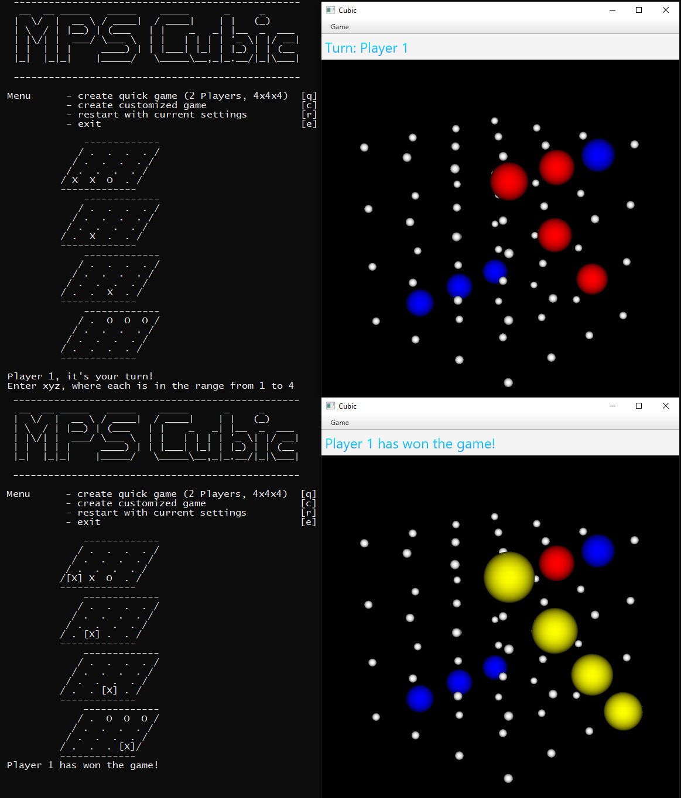

A Scala project for the lecture "Moderne Programmiersprachen" at HTWG Konstanz (2014).

Features:

- Game implemented with an immutable object model
- Supports arbitrary board sizes (n * n * n) and any number of players
- Utilizes the Model-View-Controller (MVC) pattern with two different views that can be displayed and used simultaneously
  - 2D Command Line Interface (CLI) with "ASCII Art" rendering of the game board
  - 3D user interface, built with ScalaFX, including a clickable and rotatable cube

